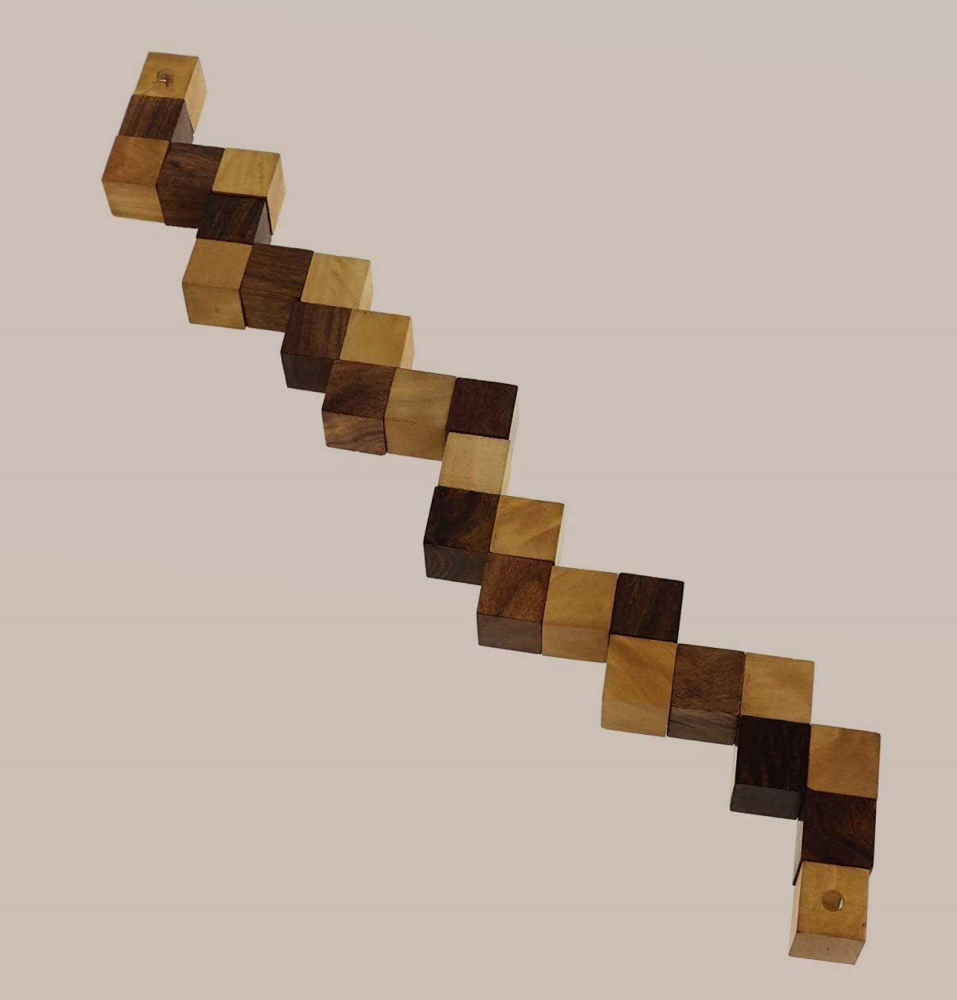
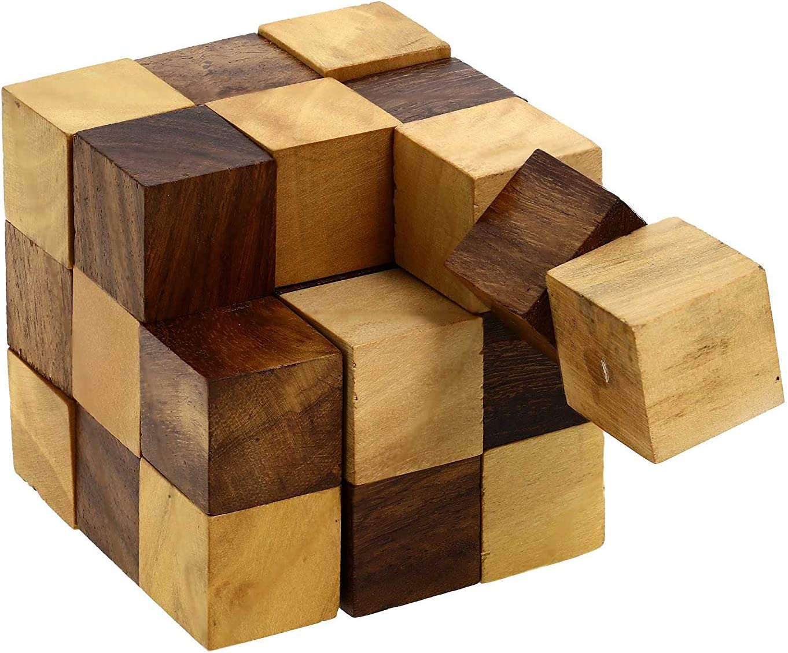

# About

This repo contains a program to solve and plot the snake cube puzzle. The goal of the snake cube is to arrange the beams of bright and dark blocks into a single 3x3x3 cube. 

 

The solver initially sets up a "flat snake":

https://user-images.githubusercontent.com/33225551/191009689-a7ac1bb6-b823-49a3-8b33-c4832564b6fc.mp4

It then examines all possible rotations by brute force. As it turns out there are not one but two possible solutions:

https://user-images.githubusercontent.com/33225551/191009753-e659fdee-5b47-4397-8b3e-8c721b38ce7b.mp4

https://user-images.githubusercontent.com/33225551/191009775-03ad9be1-b009-4bc1-b5f4-5f3e1100f015.mp4

Have a nice day.

# Build

Plotting is done via [matplot++](https://github.com/alandefreitas/matplotplusplus). Note that `matplot++` has certain system dependencies (e.g. `gnuplot`) that are required at runtime.

# Disclaimer

This project was an excuse for me to implement and learn more about quaternions.
